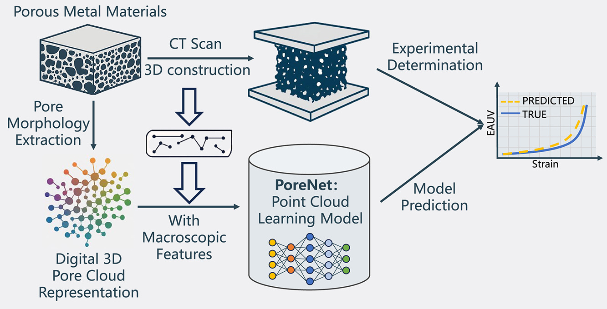

## 3D pore cloud-informed deep learning framework for multiscale structure–energy absorption correlation in porous sandwich materials

Created by Jiaxiu Zhang, Wei Zhao, Ran Chen, Liangliang Nan, Wenhao Chen, Mingqiang Wei from Nanjing University of Aeronautics and Astronautics.



### Introduction

This repository contains the implementation of **PoreNet**, a point cloud-based deep learning architecture for predicting the energy absorption of porous aluminum foam sandwiches (AFS).

Due to the irregular and multiscale nature of pore morphologies, predicting the mechanical performance of AFS remains challenging for traditional models. This work proposes a novel 3D pore cloud representation to capture detailed geometric and topological information from real AFS cores.

In this repository, we release code and data for training a PoreNet network on our dataset.

### Citation
If you find our work useful in your research, please consider citing:
```plaintext
@article{ZHANG2026119910,
title = {3D pore cloud-informed deep learning framework for multiscale structure–energy absorption correlation in porous sandwich materials},
journal = {Composite Structures},
volume = {378},
pages = {119910},
year = {2026},
issn = {0263-8223},
doi = {https://doi.org/10.1016/j.compstruct.2025.119910},
url = {https://www.sciencedirect.com/science/article/pii/S026382232501075X},
author = {Jiaxiu Zhang and Wei Zhao and Ran Chen and Liangliang Nan and Wenhao Chen and Mingqiang Wei}
}
```

### Installation

This project is based on PyTorch 2.1.1 and CUDA 11.8.

First, install PyTorch with CUDA support using pip:

```bash
# CUDA 11.8
pip install torch==2.1.1 torchvision==0.16.1 torchaudio==2.1.1 --index-url https://download.pytorch.org/whl/cu118
```

Install the remaining dependencies using pip:

```bash
pip install -r requirements.txt
```

### Usage

1. Configure WandB

This project uses [Weights & Biases (WandB)](https://wandb.ai/) for experiment tracking and hyperparameter tuning. Make sure you are logged in:

```bash
wandb login
```

2. Data Preparation

Split the raw dataset into training and testing sets. This script will process data from `dataset/all_data/` and create `dataset/train` and `dataset/test` directories.

```bash
python split_dataset.py
```

3. Training

Train the model using `train.py`. You can configure various hyperparameters via command-line arguments.

Basic usage:
```bash
python train.py
```

Common arguments:
- `--lr`: Learning rate (default: 0.0031)
- `--batch_size`: Input batch size (default: 32)
- `--nepoch`: Number of epochs to train (default: 500)
- `--dropout`: Dropout rate (default: 0.3)
- `--dataset`: Path to the dataset (default: 'dataset')
- `--ckpt`: Path to save checkpoints (default: 'ckpt')
- `--use_att`: Whether to use attention mechanism (default: True)

Example:
```bash
python train.py --batch_size 64 --nepoch 100 --lr 0.001
```

4. Hyperparameter Sweep (WandB)

Use `sweep.py` to run hyperparameter sweeps with WandB for tuning the model.

```bash
python sweep.py
```

5. Prediction

Evaluate the model and generate predictions using `predict.py`.

Basic usage:
```bash
python predict.py
```

Common arguments:
- `--model`: Path to the trained model checkpoint (default: 'ckpt/best_model.pth')
- `--dataset`: Path to the dataset (default: 'dataset')
- `--result_path`: Directory to save prediction results (default: 'test_results')
- `--batch_size`: Input batch size (default: 128)

Example:
```bash
python predict.py --model ckpt/best_model.pth --result_path my_results
```

### License
Our code is released under MIT License (see LICENSE file for details).